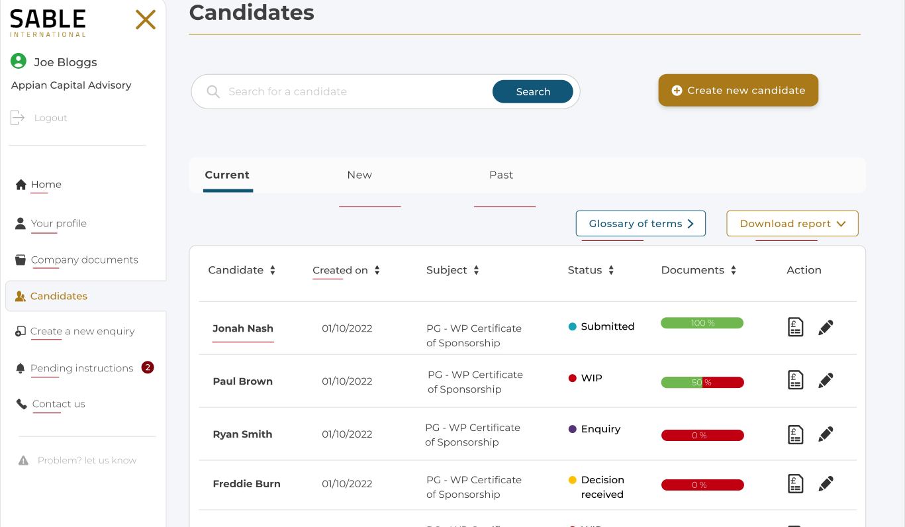

# BI / SIPI

## Your profile



### Candidate search

```sql
dbo.candidateSearch
    @query varchar
```

This will need a result table, or would need to be integrated with the candidate grid already shown on the page.

Perhaps we can add another tab, called 'Search', next to the tabs... Current, New and Past


### Create new candidate button

Clicking this will take you to 'Create a new enquiry' page.

### Candidate table

We can plan for -+1000 rows, so we will need paging from the DB side.

We should also then implement sorting from the DB, but it may be a bit messy,
for example, should we sort by multiple fields or single fields?

I think the sorting should be made simpler for the DB, by specifying the exact sorting text, eg 'firstname asc'. I will add commas, ans the DB can split it by commas, to create the sorting sql

```sql
dbo.getCandidates
    @pageNumber int,
    @rowsPerPage int,
    @orderby varchar = 'status desc, lastname asc'
```

| Label      | Data type |
| ---------- | --------- |
| Fist name  | Varchar   |
| Last name  | Varchar   |
| Created on | DateTime  |
| Subject    | Varchar   |
| Status     | Varchar   |
| Documents  | Integer   |

### TODO

- download report button
- search result display?
