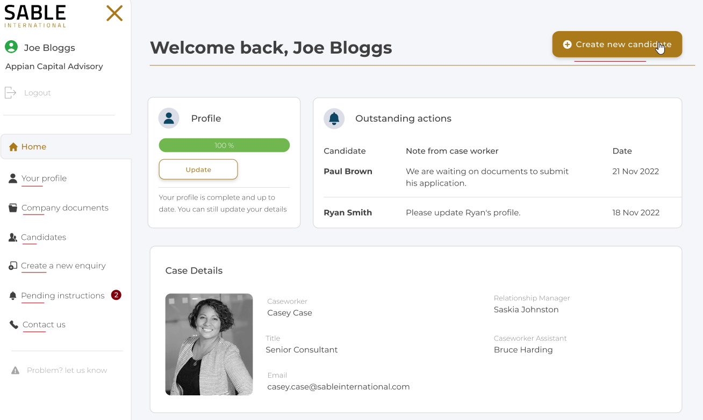

# BI / SIPI

## Home



### Profile completeness

```sql
dbo.getProfileCompleteness
    @crmGuid -- is this the correct parameter?
```

| Label      | Data type | Example |
| ---------- | --------- | ------- |
| Percentage | integer   | 77      |

### Outstanding actions

```sql
dbo.getOutstandingActions
   @crmGuid -- is this the correct parameter?
```

| Label     | Data type |
| --------- | --------- |
| Candidate | varchar   |
| Notes     | varchar   |
| Date      | datetime  |

### Case details

```sql
dbo.getCaseDetails
    @crmGuid -- is this the correct parameter?
```

| Label               | Data type | Example                                   |
| ------------------- | --------- | ----------------------------------------- |
| Image               | varchar   | \\egnytepath\caseworker\wuiertwi23423.jpg |
| Caseworker          | varchar   |
| Title               | varchar   |
| Email               | varchar   |
| RelationshipManager | varchar   |
| CaseworkerAssistant | varchar   |
